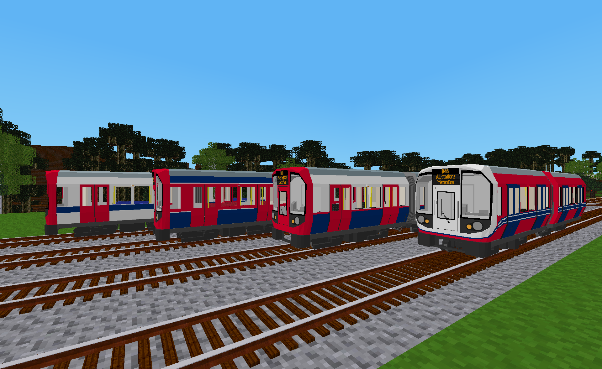

# TfL S7 Stock Generic Livery Pack

This mod adds generic livery options for the wagons in the **[TfL S7 Stock Modpack](https://content.minetest.net/packages/advtrains_supplemental/tfl_s7_stock_modpack/)** mod.

## Liveries

This livery pack provides 5 additional livery templates for each of the two TfL S7 Stock wagons in the **TfL S7 Stock Modpack** mod. These livery templates each have multiple overlays that can be customized by players while in game to create many different livery designs.  These liveries are generic in that they are not intended to represent any particular railway.  Also included are several predefined liveries that showcase some of the custom livery design possibilities when using the included templates.

## Licenses

Copyright © 2023 Marnack

- TfL S7 Stock Generic Livery Pack code is licensed under the GNU AGPL version 3 license, see [LICENSE.txt](LICENSE.txt) for details.
- Unless otherwise specified, TfL S7 Stock Generic Livery Pack media (textures and images) are licensed under [CC BY-SA 3.0 Unported](https://creativecommons.org/licenses/by-sa/3.0/).

### Attributions

The following items from prior art were included in whole or in part in this mod:

- From the mod for Minetest named "TfL S7 Stock Modpack":
	- Portions of the textures from advtrains_london_s7dm.png and advtrains_london_s7ndm.png (CC BY-SA 3.0 by Mainote Plants Lab)
